# MIS 587 Guide to Data Warehouse SSIS Installation

Please follow below steps to setup and install below software, make sure your hard drive has at least 20GB free space: 

(For MAC users, ask IT to install Windows and perform below steps or borrow a windows laptop from UA library)

 

1. download Visual Studio Community 2017 from the Developers Tool section of Microsoft Imagine. Install the visual studio without Add-On’s (around 600 MB size) 

https://www.visualstudio.com/downloads/

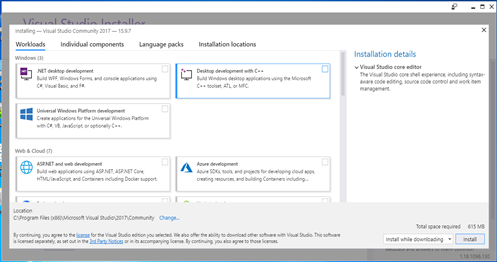

 

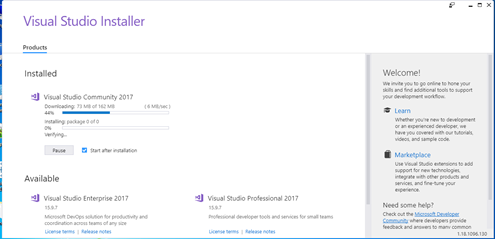

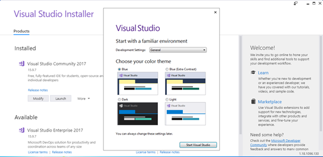

2. Download SQL Server Express. 

Click on Customize. Follow the instructions to set up SQL Server. Make a note of Server Instance Name. Choose authentication as Windows Authentication 

https://www.microsoft.com/en-us/sql-server/sql-server-downloads

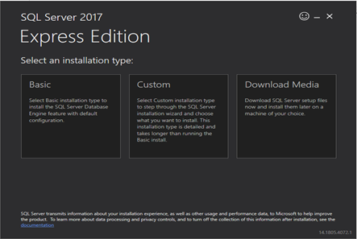

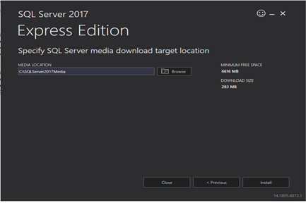

 

Click “New SQL Server stand-alone installation or add features …”

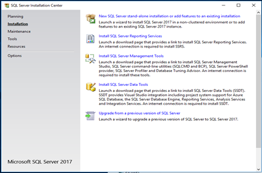

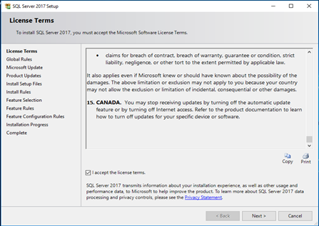

If have Windows Firewall warning, You can turn off firewall in control panel or enable the required ports following the link  

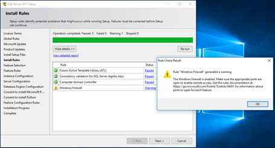

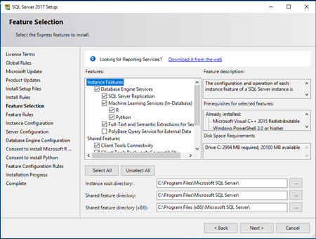

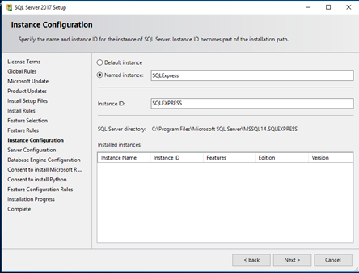

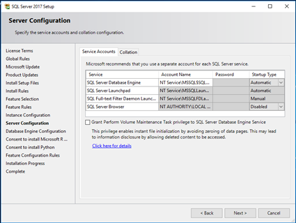

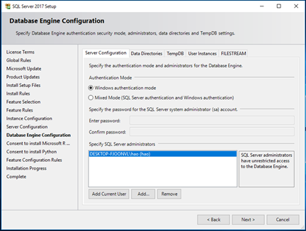

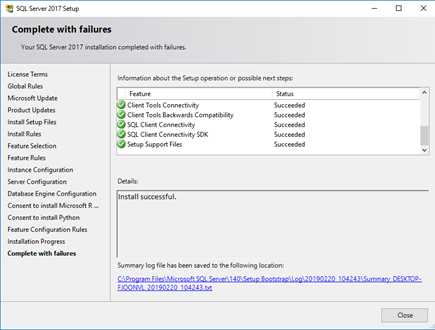

 

3. Install SQL Server Management studio (latest version) 

Click on ‘Download SQL Server Management Studio 17.4**’** 

Run the installation files 

https://docs.microsoft.com/en-us/sql/ssms/download-sql-server-management-studio-ssms

 

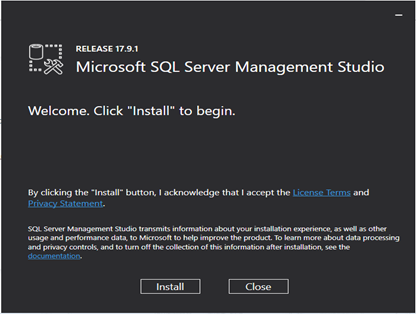

 

 

 

 

4. Next download SQL Server Data Tools (Download SSDT for Visual Studio 2017) from the below link (find “SSDT standalone installer”)

https://docs.microsoft.com/en-us/sql/ssdt/download-sql-server-data-tools-ssdt

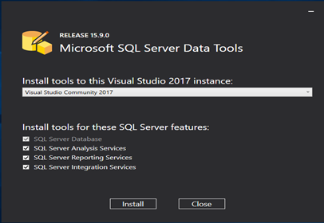

 

5. After SQL Server Data Tools has been installed, open Visual Studio 2017. 

After opening Visual Studio 2017, choose File Tab -> New -> Project, from left sidebar, you should be able to find Installed -> Business Intelligence -> Integration Services, and create new project.

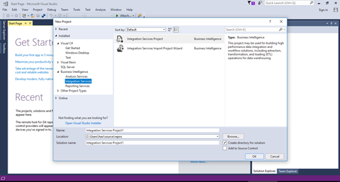

 

6. Open Microsoft SQL server Management Studio. Choose server type as Database Engine, Appropriate server name and authentication as Windows Authentication. Click Connect. You should get an object explorer window. On drilling down, you can see various folders, one of which is databases.

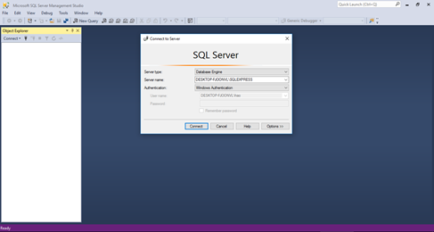

 

 

 

**NOTE:**

a.       For MAC users, ask IT to install Windows and perform above steps 

b.       If you are not able to find the instance name/ Server name to connect to database engine. Follow below steps: 

Navigate to: 

Start->All Program->Microsoft SQL Server-> Configuration Tools-> SQL Server Configuration Manager->SQL Server services 

Verify the name of server instance. Check the state of Server instance. It should be in running state

c.       You can use the following or any other such video as a guide to installation 

https://www.youtube.com/watch?v=UcsItGq3mmM